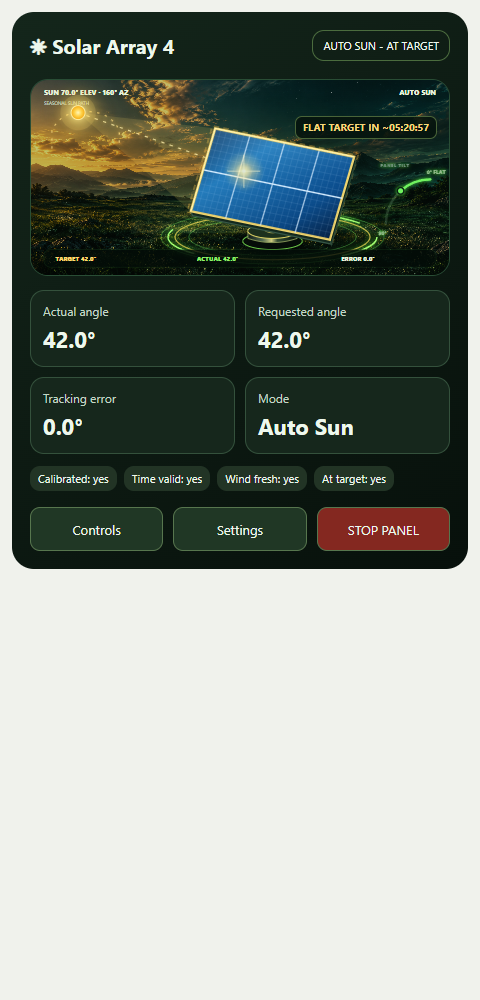
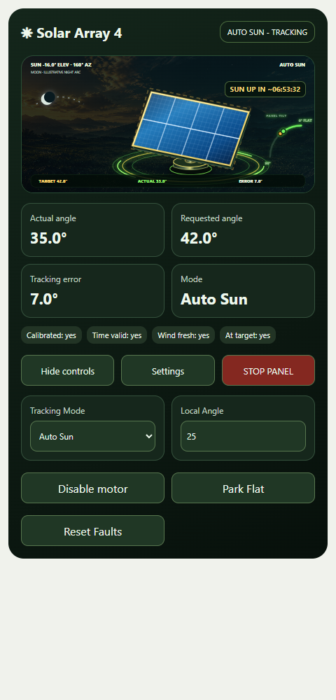

# Tryon Solar Tracker Card

A Home Assistant dashboard card for Tryon solar trackers. Select one **Actual Solar Angle** entity to discover the readings and controls on that same device. Uses the existing **ESPHome integration**; MQTT is not required for this card.



The graphics use the lightweight ESP32 tracker style: a dark grid, blue panel cells, gold frame, pedestal, seasonal sun path, a nighttime moon, and a 0° flat / 90° upright gauge. The panel shows the real reported angle. There is no landscape image, continuous animation or blur filter. Readings update the existing scene instead of rebuilding the card. Loading the card does not command movement.

## Install with HACS

Requires Home Assistant **2026.6.0 or newer**, HACS, and tracker entities available in Home Assistant. No button-card, Mushroom or card-mod dependencies.

1. Open **HACS → three-dot menu → Custom repositories**.
2. Add `https://github.com/Tryon-Electronics/tryon-solar-tracker-card` and select **Dashboard** as the type (older HACS versions call it Lovelace or Plugin).
3. Find **Tryon Solar Tracker Card** in HACS and select **Download**.
4. Reload the Home Assistant browser page. In your dashboard, choose **Edit → Add card → Tryon Solar Tracker**.
5. Select your tracker's **Actual Solar Angle** sensor, such as Solar Array 4. Save. Add another card and select Array 2 to show both.

[Open this repository in HACS](https://my.home-assistant.io/redirect/hacs_repository/?owner=Tryon-Electronics&repository=tryon-solar-tracker-card&category=plugin)

This is currently a **HACS custom repository**. It is not yet in the default searchable HACS catalog.

HACS installs the self-contained JS module from `dist/`. For normal storage-mode dashboards it also registers the resource. If you use YAML resources or the card is missing from the picker, add this resource once with type **JavaScript module**:

```yaml
url: /hacsfiles/tryon-solar-tracker-card/tryon-solar-tracker-card.js
type: module
```

If upgrading from a manual installation, replace the old `/local/tryon-solar-tracker-card.js` resource with the HACS resource; avoid registering both. Existing card YAML remains valid. Updates are downloaded through HACS, followed by a browser reload. To get the latest main-branch update, open the repository in HACS, select **⋮ → Redownload → main**, then refresh each phone/browser. All existing cards use the updated resource; no card YAML changes are needed.

## Add Solar Array 4

Choose its Actual Solar Angle entity in the visual editor, or use:

```yaml
type: custom:tryon-solar-tracker-card
entity: sensor.solar_array_4_actual_solar_angle
show_controls: true
controls_expanded: false
```

Your entity ID may differ if you renamed it. Related entities are discovered by device registry and original name or standard suffix. Ambiguous matches are left unresolved. Expand **Entity overrides (optional)** in the editor to pick missing or renamed readings and controls. When registry access is unavailable, discovery only tries the selected sensor's exact standard prefix.

```yaml
type: custom:tryon-solar-tracker-card
entity: sensor.solar_array_4_actual_solar_angle
title: South Array
mode: select.renamed_array_4_mode
stop: button.renamed_array_4_stop
show_controls: true
controls_expanded: false
```

Examples for [Array 2](examples/solar-array-2.yaml) and [Array 4](examples/solar-array-4.yaml) are included. `show_controls: false` hides the controls for a display-only card; Home Assistant user permissions still apply.

## Custom top-right label and templates

Select a sensor in **Entity overrides → Tracking Status** to show a different
reading in the top-right badge. Its `unit_of_measurement` is included automatically:

```yaml
type: custom:tryon-solar-tracker-card
entity: sensor.solar_array_0_actual_solar_angle
show_controls: true
status: sensor.totals_pv_power
```

This displays `6535 W` when the sensor's value is `6535` and its unit is `W`.
Unknown/unavailable readings are not presented as valid measurements.

For custom formatting, use **Status template (optional)** in the visual editor,
or add a `status_template` containing a Home Assistant Jinja template:

```yaml
type: custom:tryon-solar-tracker-card
entity: sensor.solar_array_0_actual_solar_angle
show_controls: true
status: sensor.totals_pv_power
status_template: >-
  {{ states('sensor.totals_pv_power') ~ ' ' ~
     (state_attr('sensor.totals_pv_power', 'unit_of_measurement') or '') }}
```

Use `~` to join text, and `or ''` for an absent unit. You can also use `entity`
in the template for the selected status sensor, and `tracker_entity` for the
card's Actual Solar Angle sensor. For example, `PV {{ states(entity) }} W`.
An empty template field returns to entity mode. A nonempty template replaces
the normal label; units are not added a second time to template output.

Templates are rendered by Home Assistant over its
[native template subscription](https://github.com/home-assistant/frontend/blob/dev/src/data/ws-templates.ts).
Home Assistant pushes dependency changes; the card does not poll templates on
every tracker update. Subscriptions are replaced when configuration changes
and cleaned up when the card leaves the dashboard. Output is plain escaped
text, not HTML. Invalid templates show an error and recover when rendering
succeeds. Existing angle-unavailable, motor-fault, safety-park and motor-disabled
status messages retain priority over custom labels.

## What the card shows

- Actual and requested angles, tracking error and status.
- Calibration, valid time, fresh wind data and fault indicators.
- A basic view with a **Controls** button to expand tracking mode, local angle, motor enable, Park Flat and Reset Faults. **STOP PANEL** stays accessible in the basic view.
- A **Settings** link opens the selected tracker’s Home Assistant device page. Use its ESPHome/device configuration link for calibration, limits and advanced safety setup. MQTT remains an automation input, not the card’s settings store.
- A daytime **SUN DOWN IN** countdown to sunset and a nighttime **SUN UP IN** countdown to sunrise. The timer updates once per second without redrawing the scene. Faults and safety holds remain visible in the status header.

Selecting a control sends a real Home Assistant command to that tracker. Unavailable controls are disabled; button states of `unknown` before their first press are normal and remain actionable; missing required fault data is shown as missing rather than clear. The separate Wrong Direction and No Movement diagnostic entities are optional because firmware disables them by default; Motor Fault already aggregates both. Enable the detailed entities on the ESPHome device page if you want their separate indicators. If the actual angle is unavailable, the card does not animate a pretend panel.

The seasonal illustration uses the tracker's saved location, clock, facing and limits. If location or clock readings are absent, it uses Home Assistant's configured location and browser time, marked in the scene. Sun timing does not require the optional angle-limit settings. If tracker location is unavailable, sunrise/sunset times come from Home Assistant’s `sun.sun` entity or configured location. Missing required status entities remain called out. The moon is illustrative, not a calculated lunar ephemeris.



Screenshots use sample Home Assistant states; the card itself displays live tracker readings. The scene is drawn locally in SVG and makes no image requests.

## Manual installation

Download `dist/tryon-solar-tracker-card.js` into your Home Assistant `config/www/` directory.

Add `/local/tryon-solar-tracker-card.js?v=0.5.0` as a JavaScript module resource, then reload. If you just created `www`, restart Home Assistant once.

## Development and releases

Requires Python 3.10+ and Node.js 22+.

```sh
npm install --ignore-scripts
npm run build
npx playwright install chromium
npm test
```

Edit `src/card.js` and run the build to regenerate the self-contained module in `dist/`. The solar helper is scoped to the card. Tests use mocked Home Assistant states and service calls, covering device selection, renamed and ambiguous entities, real angle geometry, seasonal/night behavior, safety status, controls and mobile layout. No tests send commands to hardware.

Before publishing a release, update the version, rebuild and pass CI. The built JS module is self-contained; it does not require accompanying images.

Report problems through [GitHub Issues](https://github.com/Tryon-Electronics/tryon-solar-tracker-card/issues), including Home Assistant/HACS versions and any unresolved entity names. Never include API keys, passwords or tokens.

## License

[MIT](LICENSE). Copyright 2026 Tryon Electronics.
